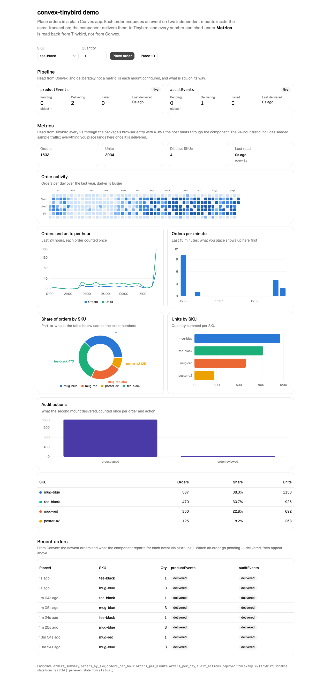

# Example app

A minimal Convex app that mounts **two named instances** of the Tinybird component and exercises
the public API end to end, plus a small Vite page that shows the metrics it tracks. It is the
developer sandbox and the portability proof at once.

## Run the demo



```bash
pnpm --dir example run dev
```

Prerequisites: Docker running and the Tinybird CLI on PATH (`pipx install tinybird`). Nothing
to configure. The launcher (`scripts/dev.mjs`):

1. provisions a local anonymous Convex deployment (no account) and writes `VITE_CONVEX_URL`;
2. starts **Tinybird Local** in Docker, deploys [`tinybird/`](tinybird/) (the `orders` and
   `audit` datasources and five endpoints) into it, seeds a day of deterministic sample orders
   straight into Tinybird so the charts have a shape before the first click, and puts its host,
   append token, signing key and workspace id on both mounts of the Convex deployment with
   `convex env set`;
3. starts `convex dev`, which pushes the functions with that environment, resumes delivery of
   anything enqueued before the destination existed, then serves Vite on
   http://127.0.0.1:5173 (`DEMO_PORT` moves it; `TINYBIRD_LOCAL_PORT` moves Tinybird).

If the deployment already points `PRODUCT_TINYBIRD_HOST` at a cloud workspace, the launcher
leaves that alone; deploy `tinybird/` there yourself with `tb deploy`.

Place a few orders (or "Place 10"). Every number and chart under **Metrics** is read from
Tinybird endpoints through the package's `./browser` entry with a JWT the host mints via
`dashboard.demoReadToken`, refreshed every two seconds: order/unit/SKU totals, a GitHub-style
activity heatmap of orders per day over the last year (the seeded history), orders and units
per hour (24h line), orders per minute (bars), share of orders by SKU (donut, with its table),
units by SKU (bars) and audit actions from the second mount (bars). The page is Vite +
React with Tailwind v4 and shadcn/ui (Base UI) components; the charts are shadcn's chart
wrappers over Recharts 3, and the heatmap is [gitmap](https://github.com/rudrodip/gitmap)
installed from its shadcn registry. Convex contributes only the **Pipeline** strip (is each
mount configured, what is pending, delivering, failed) and the **Recent orders** list with each
event's delivery state, which is how you watch an order travel from enqueue to Tinybird.

`pnpm --dir example run test:e2e` drives that page with Playwright against the real local
backend and the real Tinybird Local, asserting that Tinybird's numbers move after orders are
placed (`pnpm --dir example exec playwright install chromium` once). CI runs it and keeps the
screenshot as an artifact. The page's pure helpers (`src/metrics.ts`) have Vitest coverage.

## What it is proving

The component has to work in an application that knows nothing about it. So this app has an
ordinary domain schema (`orders`), its backend imports `convex` and `@fantastic.dev/convex-tinybird`
and nothing else, and it mounts the component twice under different names. The demo page adds
React and Vite to the example's dependencies; the boundary gate scans `convex/`, where the
portability claim lives, and the page reaches the component only through the app's own queries
and the package's `./browser` entry.

Two mounts rather than one is deliberate. The component's own test suite registers a single
instance, so it cannot see state leaking between mounts — a shared settings row, or one pause
switch stopping both streams, would pass there and fail here.

## What is enforced, and by what

- **Runtime dependencies** are enforced by `scripts/check-boundary.mjs`, which scans
  `example/convex` as well as `src`. It permits `@fantastic.dev/convex-tinybird` and rejects
  every other `@fantastic-dev/` package, `packages/backend`, and Better Auth. Component-only
  restrictions on identity reads do not apply to the host example.
- **The tsconfig mirrors the package's own compiler flags**, and that is not a hole in the claim:
  it is a build setting, not a dependency, and a real consumer writes their own. The dependency claim
  lives in `package.json` and in the boundary script, both of which are checked.

## Running it

For real delivery, first follow [Install and configure](../docs/adoption.md) and [Tinybird setup](../docs/tinybird-setup.md).
Provision destinations with schemas matching this app's `orders` and audit payloads, and set
both host and token variables for each mount. The generic `events` datasource is a separate
example. The tests below stub transport and do not provision Tinybird cloud resources.

```bash
pnpm --dir example run test       # convex-test, no network
pnpm --dir example run typecheck
CONVEX_AGENT_MODE=anonymous pnpm --dir example exec convex dev --once
```

**Credentials must be set on the DEPLOYMENT, not in your shell.** The `process.env.…` reads in
`convex.config.ts` are evaluated by the backend inside an isolate, so they resolve against the
deployment's environment — a shell variable and a `.env.local` both leave the mounts
unconfigured, and the component is _inert_ when unconfigured: enqueue still stores events,
nothing is scheduled, and no request leaves. There is no error anywhere. Verification reproduced
all three legs; only this works:

```bash
cd example

# FIRST. `convex env set` writes to a deployment, so there has to be one — on a fresh clone this
# line is the difference between the block working and `✖ No CONVEX_DEPLOYMENT set`. It is the
# same command as the last line; it appears twice because the first call PROVISIONS and the last
# call re-pushes so the mounts re-read their env.
CONVEX_AGENT_MODE=anonymous npx convex dev --once

CONVEX_AGENT_MODE=anonymous npx convex env set PRODUCT_TINYBIRD_TOKEN p.your_token
CONVEX_AGENT_MODE=anonymous npx convex env set AUDIT_TINYBIRD_TOKEN   p.your_token

CONVEX_AGENT_MODE=anonymous npx convex dev --once     # re-push so the mounts pick them up
```

Check it took: `health.configured` must be `true` on both mounts. If it is `false`, the tokens
did not reach the deployment and every enqueue will sit there silently.

`pnpm codegen` runs `CONVEX_AGENT_MODE=anonymous convex dev --once`. It provisions a local
deployment and regenerates `convex/_generated`, which is committed. It also regenerates the
component's `_generated` files through the host app that mounts it.

The host stores unfinished recovery cursors in `maintenanceCursors`, separately for each mount.
Each maintenance invocation processes one recovery page and one cleanup page per stream. Later
cron runs continue the saved scan; when it finishes, the next run starts a new scan. Do not wrap
many component calls in one host mutation: their read budgets share the parent transaction.

## Files

| Path                      | Why it exists                                                       |
| ------------------------- | ------------------------------------------------------------------- |
| `convex/convex.config.ts` | Mounts both instances with separate credentials                     |
| `convex/schema.ts`        | An unrelated domain table — the component requires nothing of it    |
| `convex/orders.ts`        | Enqueue inside the caller's transaction; status and health queries  |
| `convex/dashboard.ts`     | Recent orders with per-event state; mints the page's read token     |
| `src/`                    | The Vite page (Tinybird-backed charts) and its pure helpers         |
| `e2e/demo.spec.ts`        | Playwright: orders placed on the page arrive in Tinybird's metrics  |
| `scripts/dev.mjs`         | Boots Convex, Tinybird Local, deploys datafiles, configures, runs   |
| `tinybird/`               | The demo's datasources and endpoints, deployed with `tb deploy`     |
| `convex/maintenance.ts`   | The cron work a host owns: rescue stuck rows, then sweep            |
| `convex/orders.test.ts`   | Delivery, transactional rollback, mount isolation, conflict, replay |

`maintenance.ts` is not called `crons.ts` because Convex reserves that filename for a module
whose default export is a Crons object.
